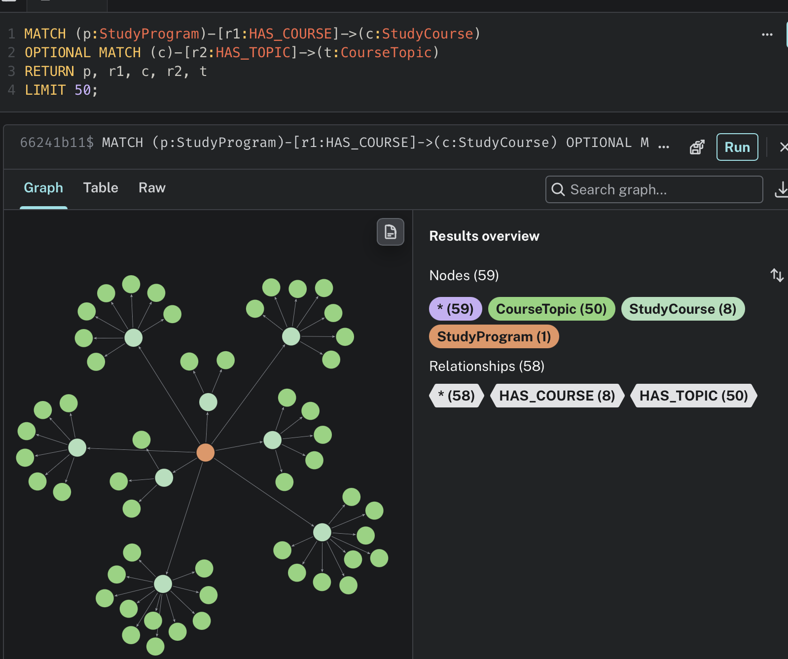
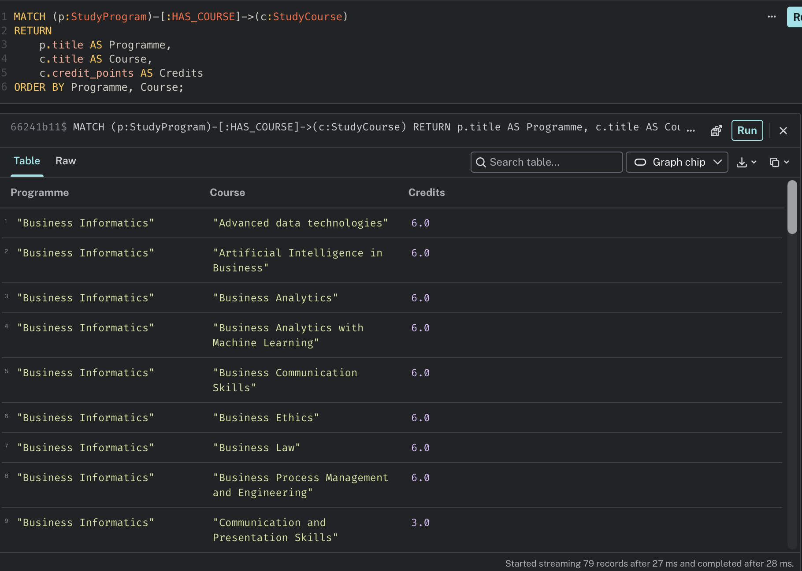
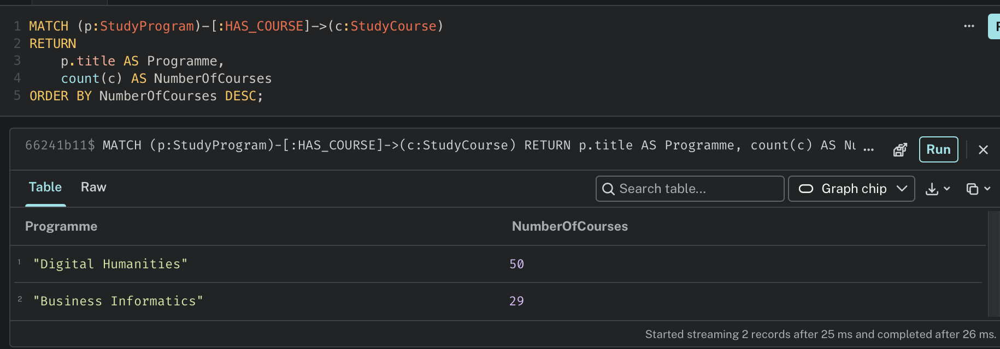
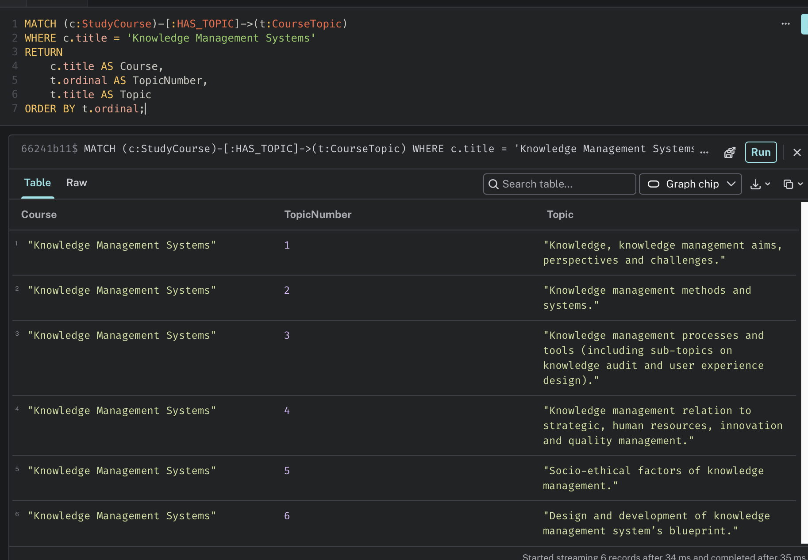
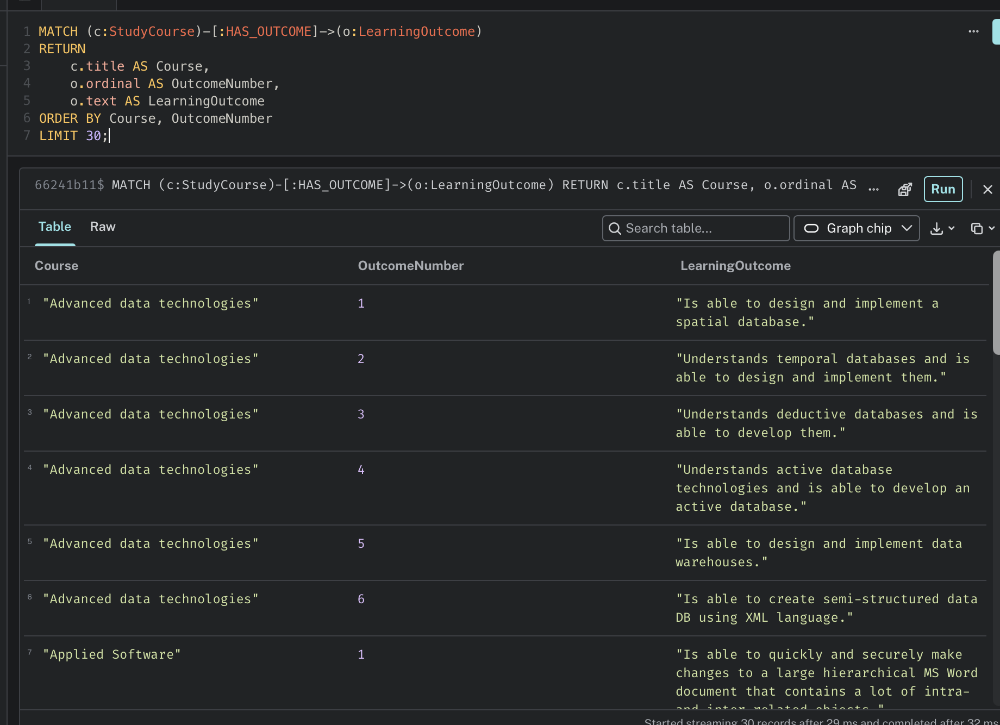
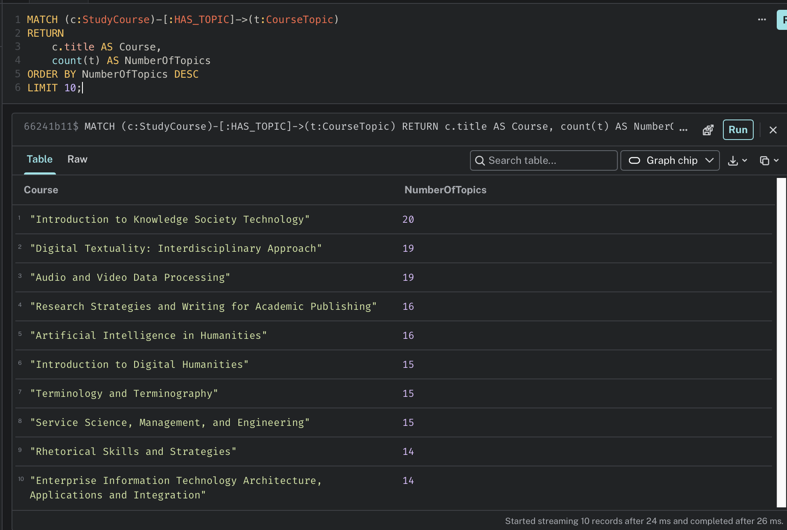

# KMS Knowledge Graph - Neo4j AuraDB

This repository contains the implementation of a Knowledge Graph using **Neo4j AuraDB** for the Knowledge Management Systems course at Riga Technical University (RTU).

The project uses the dataset provided in the following repository:

https://github.com/ArithaRTU/KMS_Dataset

## Project Objective

The objective of this project was to:

1. Explore the provided dataset.
2. Create a graph schema based on the available data.
3. Import the data into Neo4j AuraDB.
4. Run queries on the created Knowledge Graph.
5. Analyze and present the results.

## Dataset

The dataset contains information about study programmes and courses at Riga Technical University.

The main entities identified in the dataset were:

- **StudyProgram**
- **StudyCourse**
- **CourseTopic**
- **LearningOutcome**
- **StudyField**

The relationships between these entities were represented as:

```text
StudyProgram ──HAS_COURSE──> StudyCourse
StudyProgram ──BELONGS_TO_FIELD──> StudyField
StudyCourse ──HAS_TOPIC──> CourseTopic
StudyCourse ──HAS_OUTCOME──> LearningOutcome
```

## Knowledge Graph

The CSV files were imported into **Neo4j AuraDB** using Cypher queries.

After the import, the database contained:

| Node Type | Total |
|---|---:|
| CourseTopic | 640 |
| LearningOutcome | 392 |
| StudyCourse | 75 |
| StudyProgram | 2 |
| StudyField | 1 |

The following relationships were created:

| Relationship | Total |
|---|---:|
| HAS_TOPIC | 640 |
| HAS_OUTCOME | 366 |
| HAS_COURSE | 79 |
| BELONGS_TO_FIELD | 2 |

### Graph Overview



## Queries

Five queries were executed to explore the Knowledge Graph.

### Query 1 - Courses in each study programme

This query lists the courses associated with each study programme and their credit points.

```cypher
MATCH (p:StudyProgram)-[:HAS_COURSE]->(c:StudyCourse)
RETURN
    p.title AS Programme,
    c.title AS Course,
    c.credit_points AS Credits
ORDER BY Programme, Course;
```



### Query 2 - Number of courses per programme

This query counts how many courses are connected to each study programme.

```cypher
MATCH (p:StudyProgram)-[:HAS_COURSE]->(c:StudyCourse)
RETURN
    p.title AS Programme,
    count(c) AS NumberOfCourses
ORDER BY NumberOfCourses DESC;
```

The result shows:

- Digital Humanities: **50 courses**
- Business Informatics: **29 courses**



### Query 3 - Topics of the Knowledge Management Systems course

This query retrieves the topics associated with the **Knowledge Management Systems** course.

```cypher
MATCH (c:StudyCourse)-[:HAS_TOPIC]->(t:CourseTopic)
WHERE c.title = 'Knowledge Management Systems'
RETURN
    c.title AS Course,
    t.ordinal AS TopicNumber,
    t.title AS Topic
ORDER BY t.ordinal;
```

Six topics were found for the course.



### Query 4 - Learning outcomes

This query retrieves the learning outcomes connected to study courses.

```cypher
MATCH (c:StudyCourse)-[:HAS_OUTCOME]->(o:LearningOutcome)
RETURN
    c.title AS Course,
    o.ordinal AS OutcomeNumber,
    o.text AS LearningOutcome
ORDER BY Course, OutcomeNumber
LIMIT 30;
```



### Query 5 - Courses with the most topics

This query identifies the courses containing the highest number of topics.

```cypher
MATCH (c:StudyCourse)-[:HAS_TOPIC]->(t:CourseTopic)
RETURN
    c.title AS Course,
    count(t) AS NumberOfTopics
ORDER BY NumberOfTopics DESC
LIMIT 10;
```

The course with the highest number of topics was **Introduction to Knowledge Society Technology**, with **20 topics**.



## Repository Structure

```text
.
├── README.md
├── cypher/
│   ├── 01_constraints.cypher
│   ├── 02_import_nodes.cypher
│   ├── 03_import_relationships.cypher
│   └── 04_queries.cypher
├── screenshots/
│   ├── 01_nodes_validation.png
│   ├── 02_relationships_validation.png
│   ├── 03_graph_overview.png
│   ├── 04_query_courses_by_programme.png
│   ├── 05_query_course_count.png
│   ├── 06_query_kms_topics.png
│   ├── 07_query_learning_outcomes.png
│   ├── 08_query_courses_most_topics.png
│   └── 09_business_informatics_graph.png
└── report/
    └── KMS_Knowledge_Graph_Report.pdf
```

## Technologies

- Neo4j AuraDB
- Cypher Query Language
- CSV
- GitHub

## Conclusion

The dataset was successfully transformed into a Knowledge Graph using Neo4j AuraDB.

The graph structure makes it possible to explore the relationships between study programmes, courses, topics, learning outcomes, and study fields. The Cypher queries demonstrate how the graph can be used to retrieve and analyze connected educational information.

## Author

**Lucas Steffenon**

Riga Technical University  
Knowledge Management Systems
